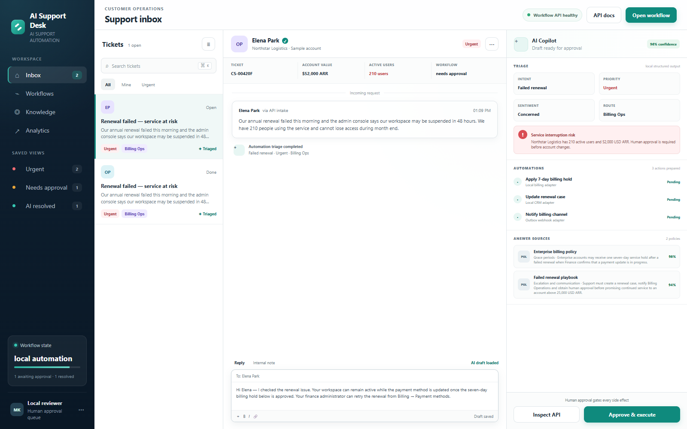
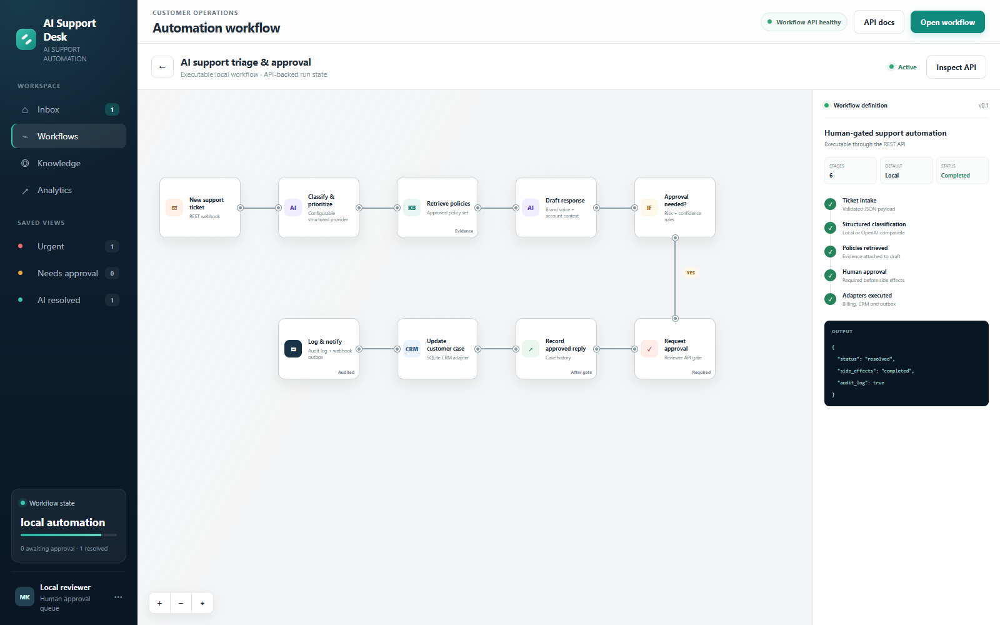

# AI Support Desk

[](https://github.com/sutasmantas/human-gated-support-automation/actions/workflows/ci.yml)
[](pyproject.toml)
[](LICENSE)

**Turn a support ticket into a policy-grounded draft, then keep consequential
actions behind human approval.**

This repository implements the whole control path: typed intake, AI-assisted
triage, policy retrieval, risk gating, approval, and idempotent side effects.
The default provider is deterministic and needs no credentials. An
OpenAI-compatible structured-output provider and an importable n8n workflow are
included for model-backed and low-code deployments.



## Try the approval flow

[](https://codespaces.new/sutasmantas/human-gated-support-automation?quickstart=1)
[](https://render.com/deploy?repo=https://github.com/sutasmantas/human-gated-support-automation)

The Codespace installs and starts the app on port 8000. Open the seeded renewal
ticket, inspect the policy evidence and proposed actions, then approve it. The
approval writes a billing hold, CRM event, audit event, and notification outbox
record. Approving the same ticket again is safe and does not duplicate effects.

The Render blueprint exposes the same local workflow. Free Render instances
sleep and use ephemeral local storage, so their demo state can reset.

<details>
<summary>See the executable workflow</summary>



</details>

## Implemented workflow

1. `POST /api/tickets` accepts a typed support request.
2. The configured provider returns intent, priority, sentiment, route, risk, and
   a draft.
3. Approved policy excerpts are attached to the decision.
4. Risk rules decide whether side effects need human approval.
5. `POST /api/tickets/{id}/approve` records a billing hold, appends a CRM event,
   and writes or delivers a notification through an outbox adapter.
6. Repeated approval requests are idempotent.

## Run locally

Requirements: Python 3.11+.

```bash
python -m venv .venv
python -m pip install -e ".[dev]"
uvicorn support_desk.main:app --reload
```

Open <http://localhost:8000>. API documentation is at
<http://localhost:8000/docs>.

One fictional enterprise renewal ticket is seeded on first launch. Approving it
changes persistent local state, so the full workflow can be inspected without
external accounts.

## OpenAI-compatible provider

Copy `.env.example` to `.env` and configure:

```dotenv
SUPPORT_AUTOMATION_PROVIDER=openai-compatible
SUPPORT_LLM_BASE_URL=https://your-provider.example/v1
SUPPORT_LLM_API_KEY=your-key
SUPPORT_LLM_MODEL=your-model
```

The model receives ticket/account context and the selected policy excerpts. It
cannot execute actions; side effects remain behind the approval endpoint.

## Notification webhook

Set `SUPPORT_NOTIFICATION_WEBHOOK_URL` to deliver approved notifications. When
unset, notifications remain in the SQLite outbox. Failed webhook requests are
recorded as failed rather than silently treated as delivered.

## Docker

```bash
docker compose up --build
```

Runtime state is persisted in the `support-data` volume.

### n8n

An importable n8n workflow is included at
[`n8n/support-approval-workflow.json`](n8n/support-approval-workflow.json). It
exposes separate intake and approval webhooks and calls the same typed API used
by the browser.

```bash
docker compose --profile n8n up --build
```

Open n8n at <http://localhost:5678> and import the JSON file from `/workflows`.
The workflow is inactive by default, so importing it cannot trigger external
actions accidentally.

## API

| Method | Endpoint | Purpose |
| --- | --- | --- |
| `GET` | `/api/health` | Provider and service health |
| `GET` | `/api/stats` | Live queue counts |
| `GET` | `/api/tickets` | List workflow state |
| `POST` | `/api/tickets` | Intake, classify, retrieve, and draft |
| `POST` | `/api/tickets/{id}/approve` | Execute approved side effects |
| `GET` | `/api/workflow` | Machine-readable workflow definition |

## Verification

```bash
ruff check .
pytest --cov=support_desk --cov-report=term-missing
```

Tests cover triage, evidence attachment, risk gating, idempotent approval,
persistent state, new ticket intake, and missing resources. GitHub Actions runs
the same checks on every push and pull request.

## Architecture and boundaries

See [docs/architecture.md](docs/architecture.md).

This repository intentionally does not claim live Stripe, Salesforce, or Slack
access. Its local adapters perform real, inspectable state changes and the
webhook outbox is the extension point for external delivery. Authentication,
multi-tenant isolation, production secrets management, and provider-specific
OAuth are explicit deployment work, not hidden behind the demo UI.

## License

MIT
