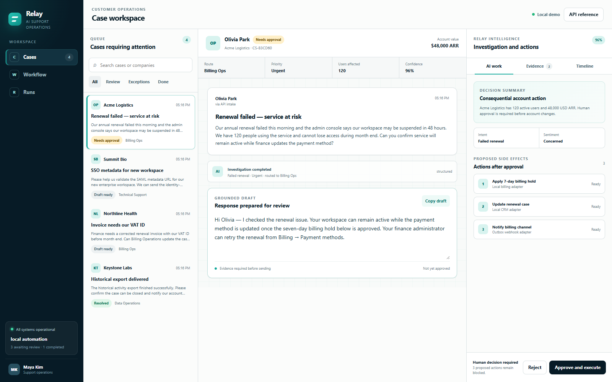
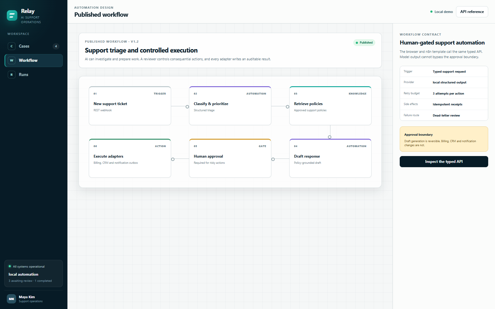
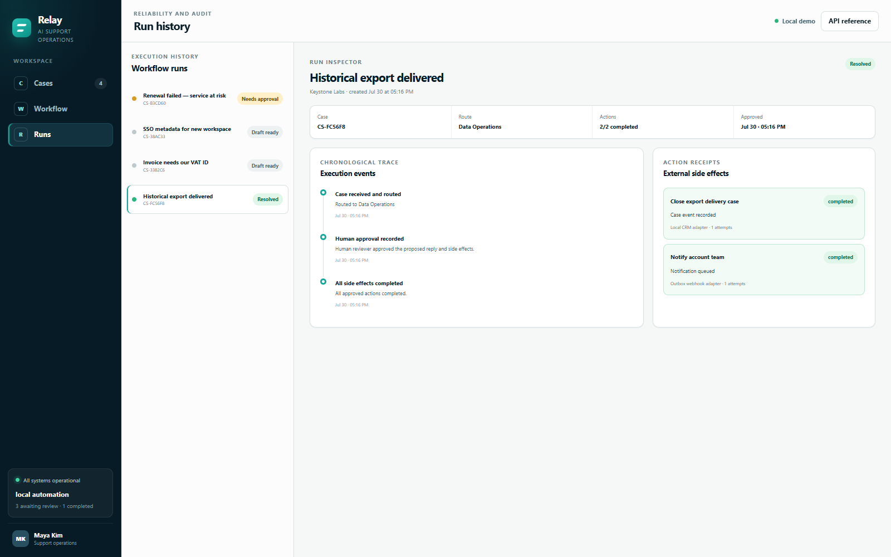

# Relay — AI support operations

[](https://github.com/sutasmantas/human-gated-support-automation/actions/workflows/ci.yml)
[](pyproject.toml)
[](LICENSE)

**A working case-operations console and governed tool runtime: investigate the
request, plan typed actions, keep consequential changes behind review, and
preserve a receipt and audit trail for every action.**

Relay is more than a static dashboard. Its queue, case workspace, workflow
canvas and run inspector all read the same FastAPI service and persistent
SQLite state. Approve, reject and retry controls execute real state
transitions; completed actions remain idempotent when another action is retried.

For a fast credential-free run:

```bash
python -m pip install -e ".[dev]"
python -m support_desk.demo_agent
```

The command starts a local HTTP target, creates the seeded renewal run, shows that
the lookup completed while all write tools remain blocked, approves the raw
arguments, performs one idempotent webhook action, and prints the persisted
tool/event lifecycle. It uses the same registry, executor, approval path and
outbound adapter as the API; no model or integration credentials are required.

### MCP quickstart

Relay also exposes the governed runtime through the official MCP Python SDK v2:

```bash
python -m support_desk.mcp_server
```

That command serves stdio for desktop/IDE launchers. The included
[`mcp.example.json`](mcp.example.json) is directly usable with the official
Inspector:

```bash
npx -y @modelcontextprotocol/inspector@2.0.0 --cli \
  --config mcp.example.json --server relay --method tools/list --format json
```

The MCP tools can inspect schemas and runs directly or create an idempotent
support-run proposal. A proposal executes the read-only lookup but leaves every
external write `awaiting_approval`; there is intentionally no MCP approval
tool. Start loopback Streamable HTTP with
`python -m support_desk.mcp_server --transport http`. See the
[MCP transport, auth, and verification contract](docs/mcp-server.md).



## What you can try

[Open the live operations workspace](https://sutasmantas.github.io/human-gated-support-automation/)

[](https://codespaces.new/sutasmantas/human-gated-support-automation?quickstart=1)
[](https://render.com/deploy?repo=https://github.com/sutasmantas/human-gated-support-automation)

The local provider seeds four fictional cases that exercise different
operating paths:

- a failed enterprise renewal that needs approval before billing and CRM changes;
- an SSO request that can be reviewed or rejected with an operator note;
- an invoice correction with retrieved policy evidence;
- a completed export that demonstrates action receipts and run history.

Open the renewal case, inspect its evidence and proposed side effects, then
approve it. The server records a billing hold, case event and notification
receipt. Repeating the approval cannot duplicate completed effects.

<details>
<summary>Workflow and run-inspector views</summary>





</details>

## Control flow

1. `POST /api/tickets` accepts and validates a support request.
2. The configured automation provider returns typed triage and a proposed reply.
3. A deterministic no-key or optional OpenAI-compatible tool planner emits the
   same bounded `ToolCall` contract.
4. The registry rejects unknown tools, extra/oversized arguments and plans over
   the configured step budget; read-only lookup can run immediately.
5. Write and irreversible tools remain pending until the human approval route
   records their raw arguments and risk class.
6. Approval executes local billing/case tools and the governed generic outbound
   adapter.
7. MCP clients may inspect this state or submit an idempotent proposal, but
   cannot approve their own proposed writes.
8. Each action has its own durable attempt and receipt. A retry skips completed
   actions and moves an exhausted failure to dead-letter review.
9. Tool-call records and workflow events preserve the reconstructable timeline.

The browser and the included n8n template call the same API. Model output cannot
bypass the server-side approval boundary.

## Run locally

Requirements: Python 3.11+.

```bash
python -m venv .venv
python -m pip install -e ".[dev]"
uvicorn support_desk.main:app --reload
```

Open <http://localhost:8000>. The OpenAPI reference is at
<http://localhost:8000/docs>.

State persists in `data/runtime/support.sqlite3`. Delete that development
database only when you intentionally want to restore the four seed cases.

## Use a model endpoint

Relay runs without credentials. To use an OpenAI-compatible structured-output
provider, copy `.env.example` to `.env` and configure:

```dotenv
SUPPORT_AUTOMATION_PROVIDER=openai-compatible
SUPPORT_AGENT_PROVIDER=openai-compatible
SUPPORT_LLM_BASE_URL=https://your-provider.example/v1
SUPPORT_LLM_API_KEY=your-key
SUPPORT_LLM_MODEL=your-model
```

The model receives ticket/account context and registered JSON Schemas. It can
classify, draft and propose calls; it cannot bypass validation, the tool-step
budget, approval, receipts or server-side execution policy. Production mode
rejects the local providers explicitly.

## Connect notifications

Set `SUPPORT_NOTIFICATION_WEBHOOK_URL` and the exact
`SUPPORT_OUTBOUND_ALLOWED_HOSTS` entry to deliver approved notifications. The
generic adapter validates the destination, bounds connect/read timeouts, sends
a configurable idempotency header, resolves optional `env:NAME` secrets, and
persists only configured redacted request/response fields. When the URL is
unset, Relay writes the notification to its local outbox. Failed calls remain
visible with their attempt count and may be retried up to
`SUPPORT_MAX_ACTION_ATTEMPTS`.

## Add a client tool or adapter

Register one `RegisteredTool` in `support_desk/tools.py` with a stable name,
description, strict Pydantic input model, risk class, external-visibility flag,
handler and operator-facing label. The executor supplies validation, approval,
attempts, receipts, retry/dead-letter state and audit events; a new handler must
not reproduce those mechanisms.

For a client-owned REST endpoint, keep the existing `OutboundHTTPAdapter` and
configure its destination, allowlist, timeouts, idempotency header, secret
reference and redaction fields. Add a new adapter class only when the protocol
or authentication lifecycle is materially different, and prove it with a local
contract fake before naming that integration in a proposal.

## Docker and n8n

```bash
docker compose up --build
```

Runtime state is persisted in the `support-data` volume.

An importable n8n workflow is included at
[`n8n/support-approval-workflow.json`](n8n/support-approval-workflow.json).

```bash
docker compose --profile n8n up --build
```

Open n8n at <http://localhost:5678> and import the JSON file from `/workflows`.
It is inactive by default.

## API

| Method | Endpoint | Purpose |
| --- | --- | --- |
| `GET` | `/api/health` | Provider and service health |
| `GET` | `/api/stats` | Queue and run counts |
| `GET` | `/api/tickets` | Cases with decisions, evidence and action state |
| `POST` | `/api/tickets` | Intake, classify, retrieve and draft |
| `POST` | `/api/tickets/{id}/approve` | Approve and execute pending actions |
| `POST` | `/api/tickets/{id}/decision` | Reject with an operator note |
| `POST` | `/api/tickets/{id}/retry` | Retry only incomplete actions |
| `GET` | `/api/tickets/{id}/events` | Retrieve the audit timeline |
| `GET` | `/api/tickets/{id}/tool-calls` | Replay planned calls, attempts and results |
| `GET` | `/api/tools` | Registered schemas, risk and capability metadata |
| `GET` | `/api/adapters/outbound` | Safe outbound-adapter configuration description |
| `GET` | `/api/workflow` | Machine-readable workflow definition |

## Verification

```bash
ruff check .
pytest --cov=support_desk --cov-report=term-missing
```

Tests cover classification, evidence, risk gating, approval, rejection,
per-action receipts, idempotency, partial failure, retry, dead-letter
exhaustion, strict tool validation, step termination, deterministic planning,
audit replay, destination security, timeout/retry classification, redaction,
the local fake, MCP structured tools, proposal-only writes, cancellation,
Streamable HTTP Host/Origin protection and bearer auth. GitHub Actions runs the
same lint/test commands on every push and pull request. The exact workflow
evidence command is `python -m support_desk.demo_agent`; the MCP external-client
command is recorded above.

See [the architecture guide](docs/architecture.md) for integration points and
deployment details.

## License

MIT
